

  

    

      
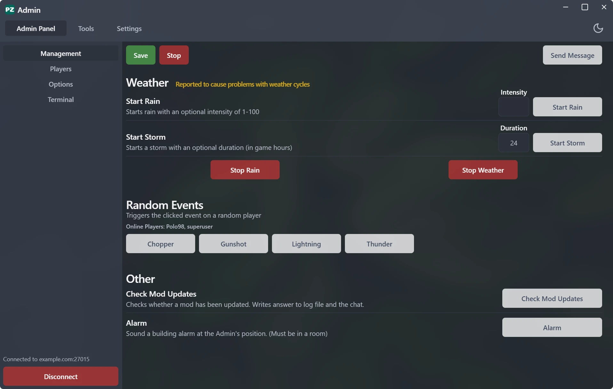

      
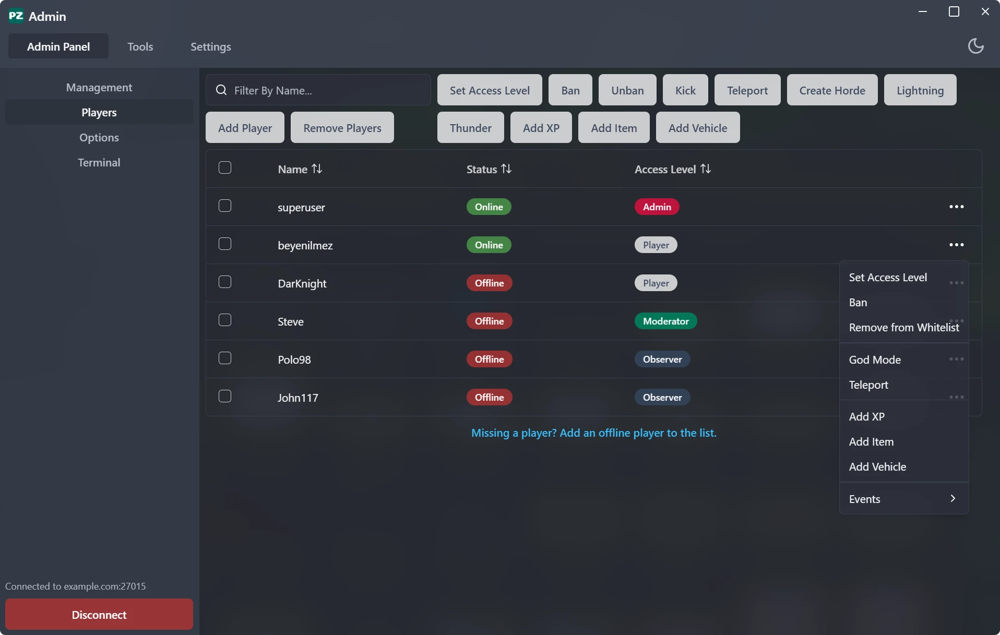

      
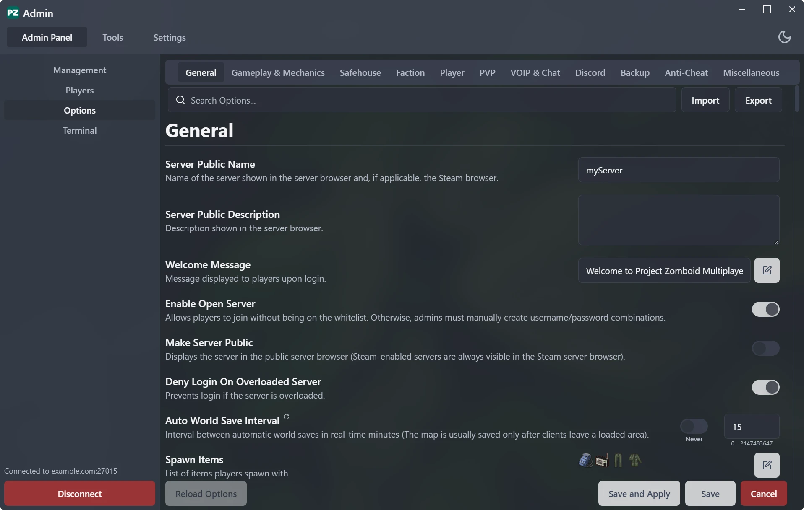

      
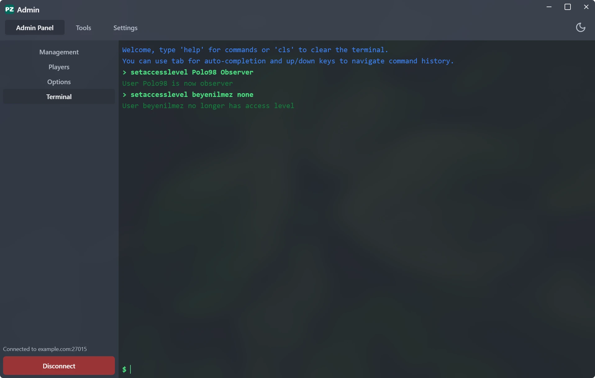

      
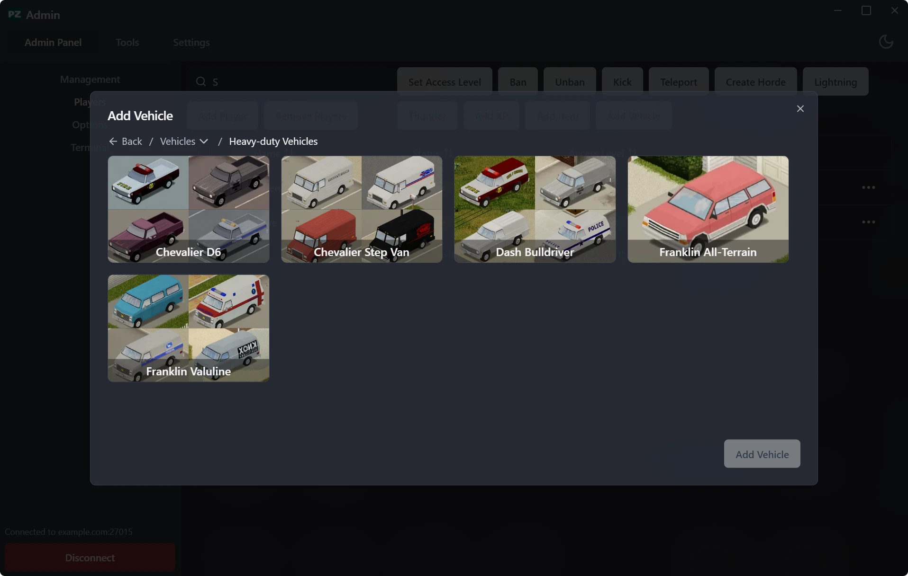

      
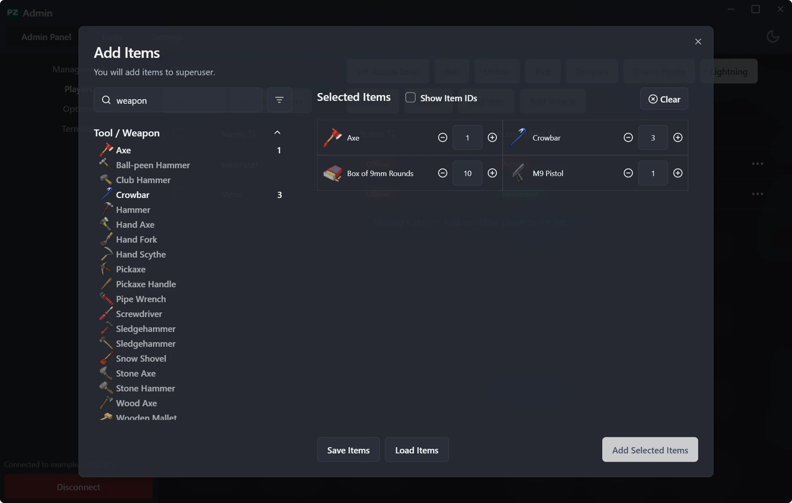

      
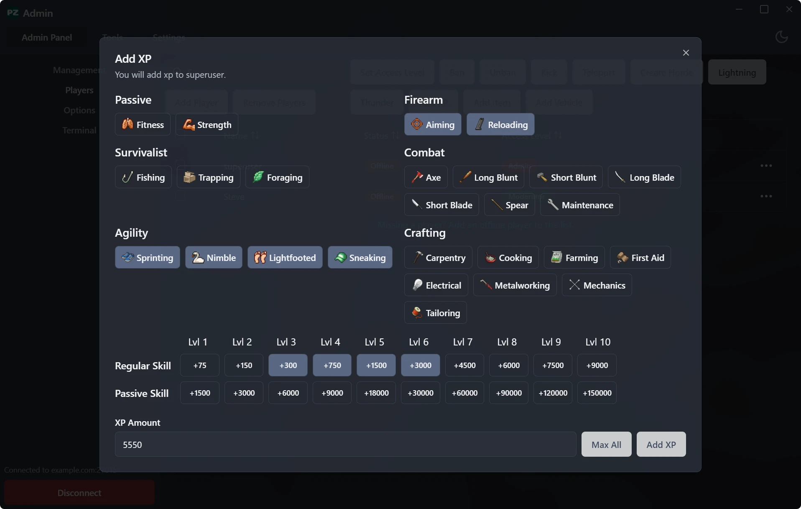

      
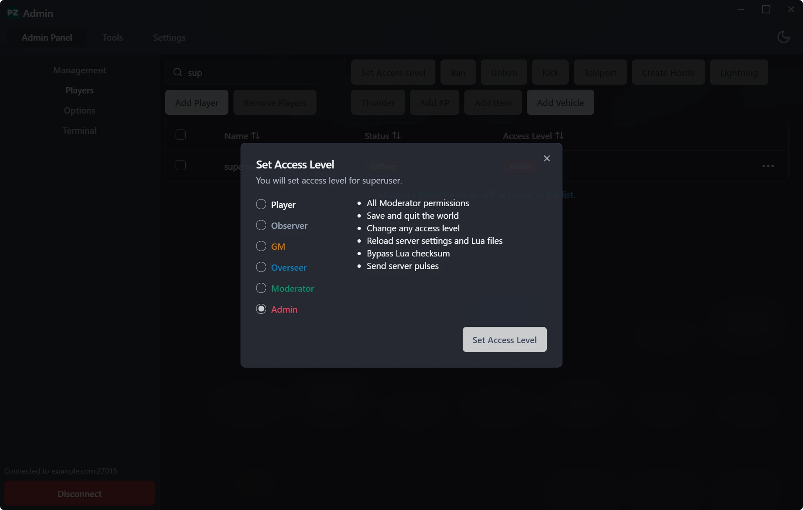

      
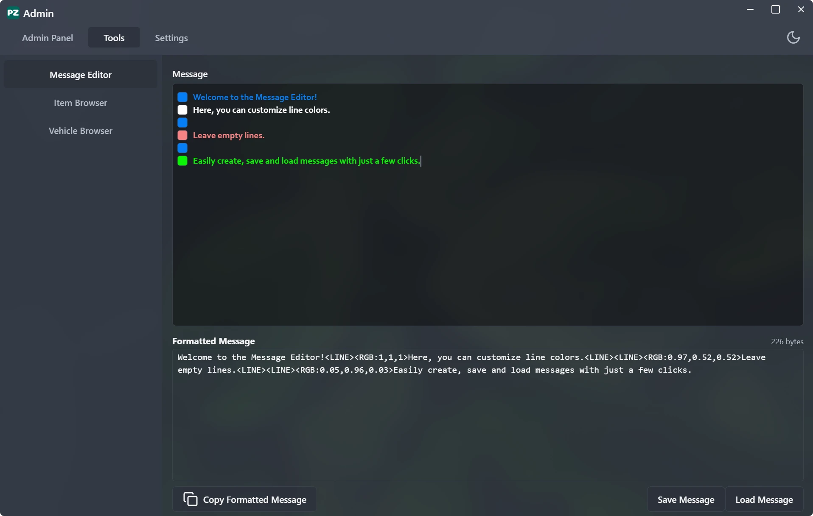

      
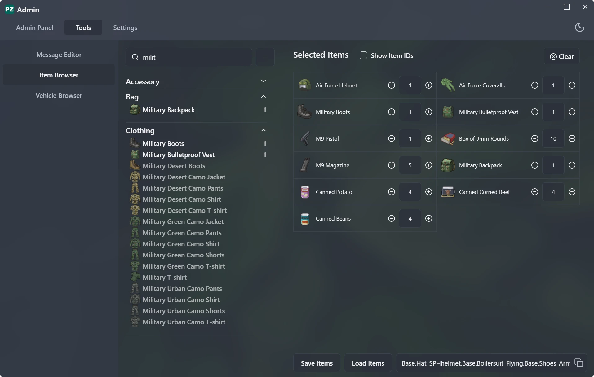

      
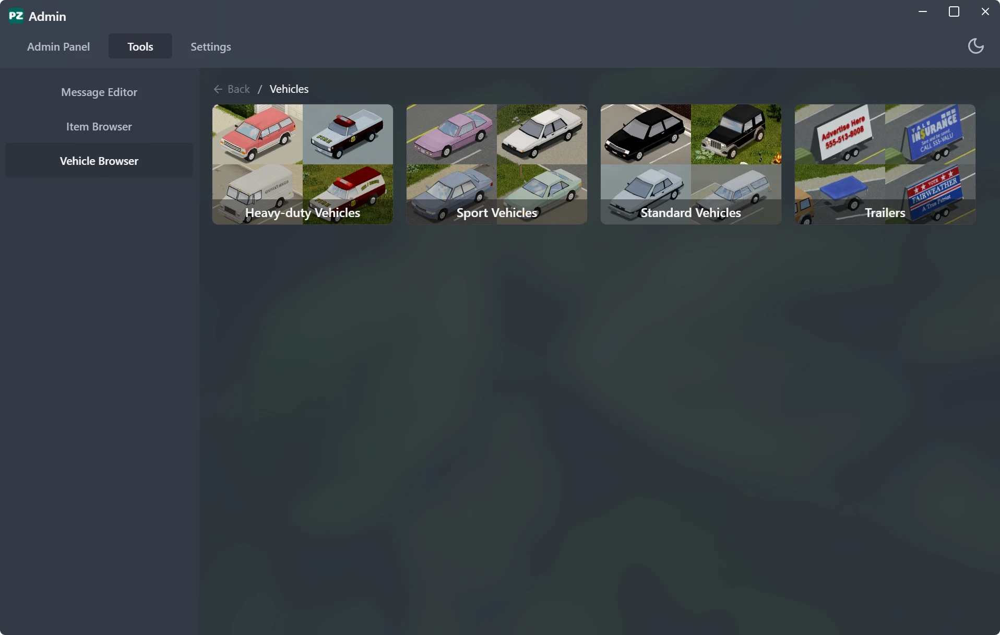

    

    

  

## Features

### Server Management

- RCON terminal for remote console access.
- Modify, import, and export server options.
- Save world, stop server.
- Send server-wide messages.
- Weather controls: Start/stop rain and weather.
- Trigger random events like choppers, gunshots, lightning, and thunder.

### Player Management

- View and manage player list.
- Add XP, items, or vehicles to players.
- Adjust access levels, ban/unban, kick, or teleport players.
- Add/remove players to/from the whitelist.
- Create hordes, lightning or thunder on specific players.

### Tools

- Message editor, item browser and vehicle browser available as standalone tools.

## License

Distributed under the MIT License. See [LICENSE](https://github.com/beyenilmez/pz-admin/blob/main/LICENSE) for more information.
